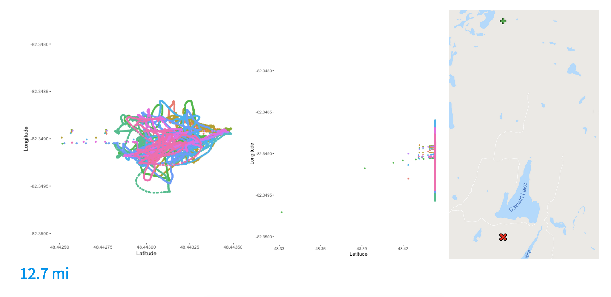
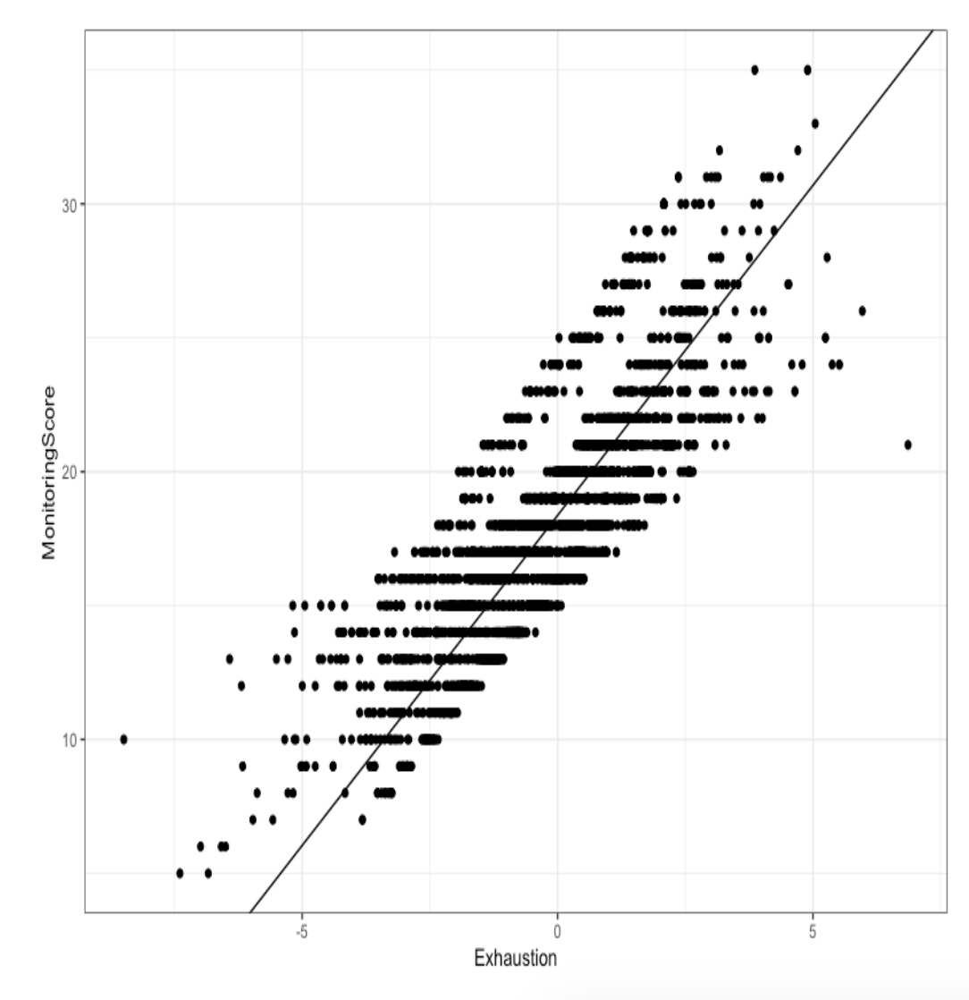
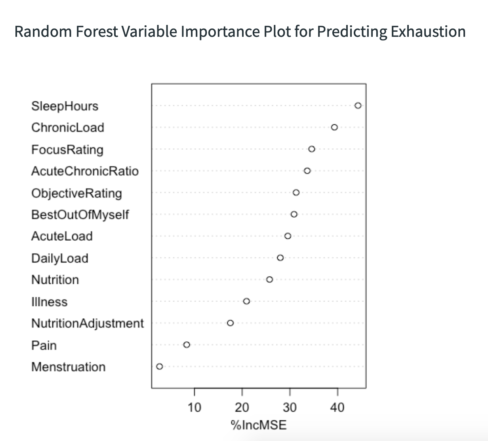

## Five College DataFest 2019: Quantifying and Predicting Exhaustion

Best in Group for the 2019 Five College Datafest. We quantified and predicted exahustion for the Canadian National Women's Rugby Team.

## Data Exploration

We found some interesting complications with the GPS data. For example, other players go from Canada to Philadelphia and back within two minutes (~1800 miles).

## Summarize Overall Fatigue

We developed a better metric summarizing overall exhaustion since MonitoringScore was a simple addition of the five variables with equal weights.

First, we standardized within PlayerID, as each player may have different subjective understandings of the scale in the wellness survey. 

Next, we used PCA (dimension reduction technique) to obtain single best predictor for Exhaustion.

Above is a graph with the x-axis as ExhaustionMS and y-axis as the MonitoringScore. 

The 1st component turned out to be the weighted average of the five monitoring variables, which explains 45% of the variability and theoretically better than MonitoringScore

## Training Analysis

We standardized RPE and training loads by the player ID and found important predictors for exhaustion.

## Game Analysis

Lastly, we predicted exhaustion using game load. Additionally, we scraped weather data on each game day to enrich our data.

We ran 17 different machine learning models and the best performing gradient boosting regressor predicted the test set exhaustion with a MSE of 2.72

We applied MLR and found that the best model only included wind speed and team point, where team points refers to the number of points the Canadian team scored in the game.
We found that higher wind speed and team points correlated with lower exhaustion.

This finding is interesting because weather was an unrecorded factor. We suggest the team to monitor weather for better analysis in the future.

Models: linear regression, decision tree, random forest, and k-nearest neighbor

## Credits

Fengling Hu, Lesley Zheng, Laboni Hoque, Clara Seo, Esther Song

